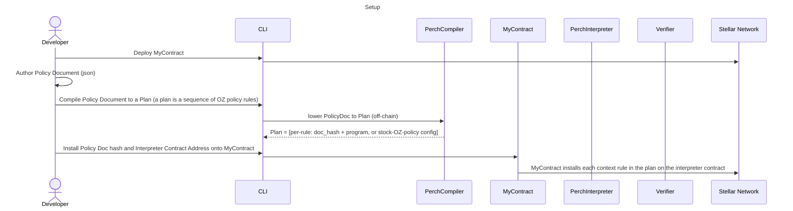

```mermaid
  sequenceDiagram
    title: Setup
    actor D as Developer
    participant CLI as CLI
    participant C as PerchCompiler
    participant MC as MyContract
    participant I as PerchInterpreter
    participant V as Verifier
    participant S as Stellar Network


    D->>CLI: Deploy MyContract
    CLI->>S:

    D->>D: Author Policy Document (json)
    D->>CLI: Compile Policy Document to a Plan (a plan is a sequence of OZ policy rules)
    CLI->>C: lower PolicyDoc to Plan (off-chain)
    C-->>CLI: Plan = [per-rule: doc_hash + program, or stock-OZ-policy config]


    D->>CLI: Install Policy Doc hash and Interpreter Contract Address onto MyContract
    CLI->>MC:
    MC->>S: MyContract installs each context rule in the plan on the interpreter contract
```
